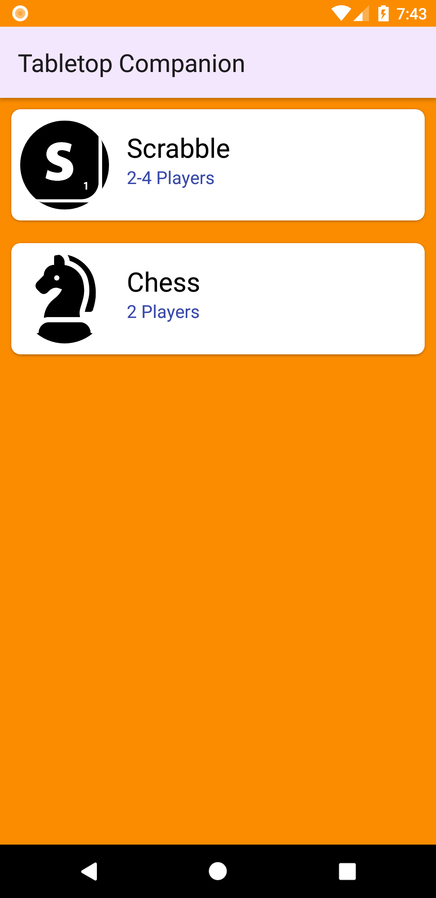
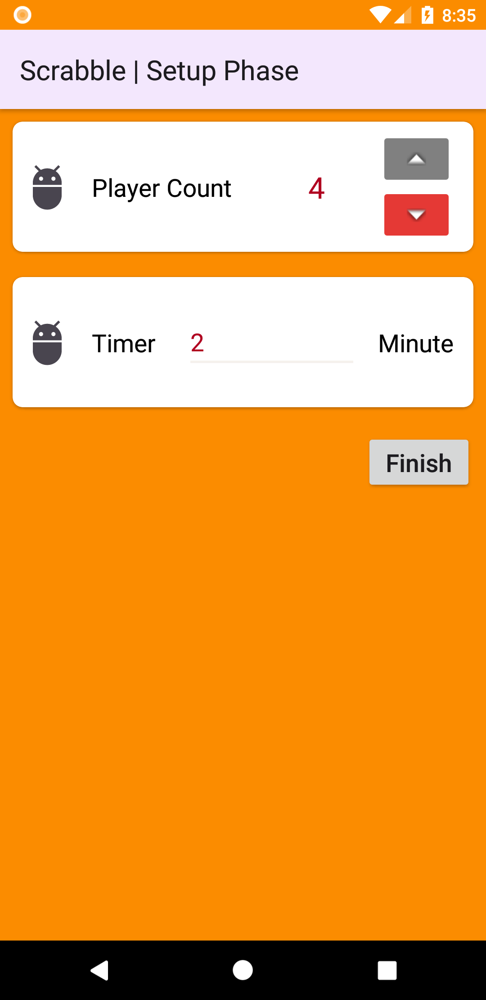
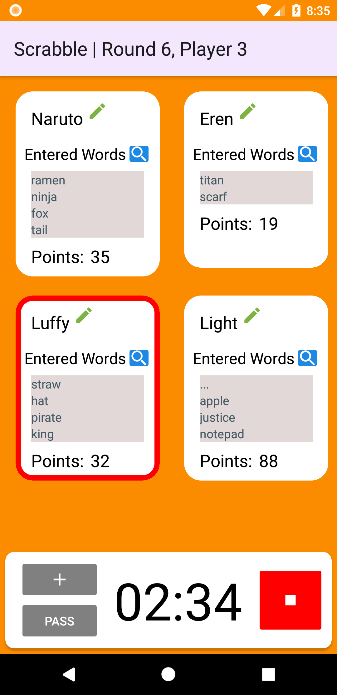
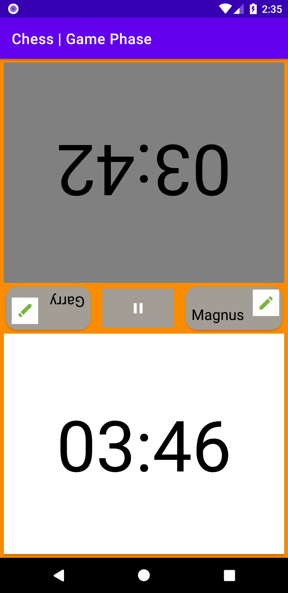

# TabletopCompanion 

A companion app for tabletop games. Currently supporting:
1. Scrabble
2. Chess
 
<a href="https://play.google.com/store/apps/details?id=com.burakcanduzcan.tabletopcompanion">
    

## Screenshots
  

 

## Libraries
- [Timber](https://github.com/JakeWharton/timber)
- Navigation Component (with SafeArgs)
- [CircleImageView](https://github.com/hdodenhof/CircleImageView)
- Hilt
- SplashScreen
- [dariobrux/Timer](https://github.com/dariobrux/Timer)

## Credits
[piece_placement.mp3](https://freesound.org/people/el_boss/sounds/546119/) by el_boss

[finished.wav](https://freesound.org/people/InspectorJ/sounds/398194/) by deleted_user_877451

<a href="https://www.flaticon.com/free-icons/scrabble" title="scrabble icons">Scrabble icons created by Freepik - Flaticon</a>

<a href="https://www.flaticon.com/free-icons/chess" title="chess icons">Chess icons created by Freepik - Flaticon</a>
