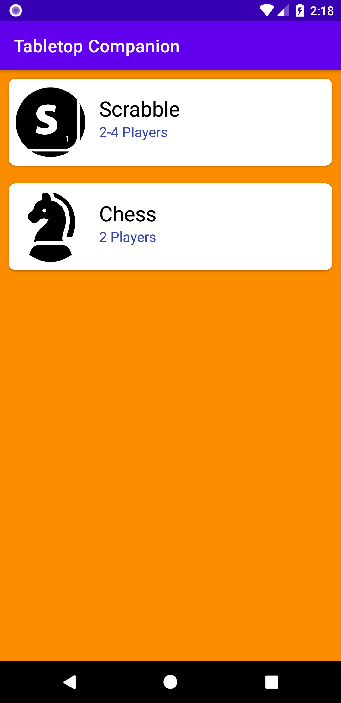
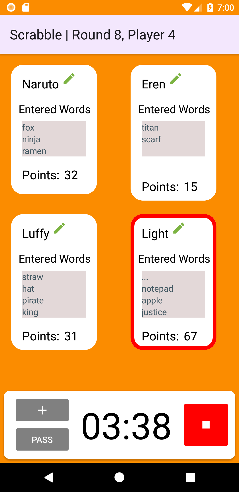
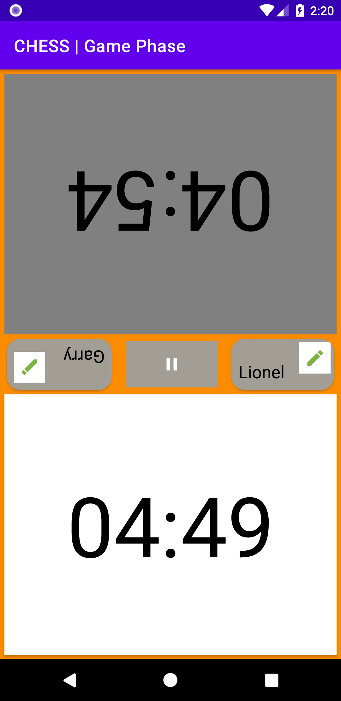

# TabletopCompanion
A companion app for tabletop games. Currently supporting:
1. Scrabble
2. Chess

## Screenshots
  

 

## Libraries
- [Timber](https://github.com/JakeWharton/timber)
- Navigation Component (with SafeArgs)
- [CircleImageView](https://github.com/hdodenhof/CircleImageView)
- Hilt
- SplashScreen
- [dariobrux/Timer](https://github.com/dariobrux/Timer)

## Credits
[piece_placement.mp3](https://freesound.org/people/el_boss/sounds/546119/) by el_boss

[finished.wav](https://freesound.org/people/InspectorJ/sounds/398194/) by deleted_user_877451
